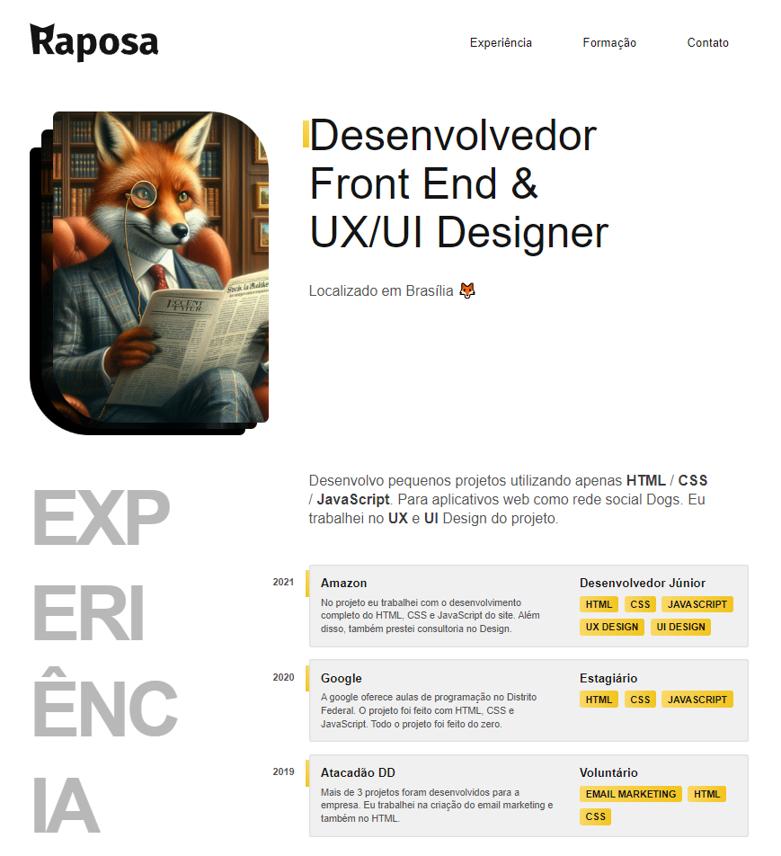
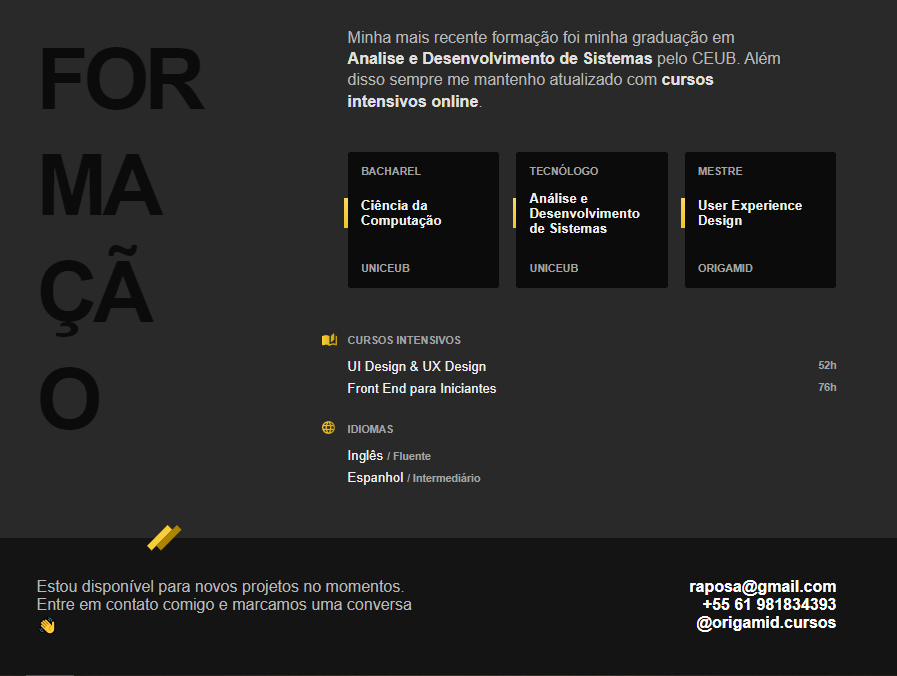

# 🦊 Portfólio do Raposo

Bem-vindo ao portfólio fictício do Raposo, uma raposa talentosa que deseja mostrar suas habilidades e projetos. Este projeto foi desenvolvido utilizando HTML e CSS, com o objetivo de praticar e demonstrar minhas habilidades de front-end.

## 📋 Índice

- [Sobre](#sobre)
- [Tecnologias Utilizadas](#tecnologias-utilizadas)
- [Funcionalidades](#funcionalidades)
- [Contato](#contato)

## 📖 Sobre

O portfólio do Raposo é um site de uma página que exibe informações sobre a raposa, seus projetos e habilidades. É um exemplo simples e bonito de como um portfólio pode ser criado utilizando apenas HTML e CSS.

## 💻 Tecnologias Utilizadas

- HTML5
- CSS3

## ✨ Funcionalidades

- **Seções de Navegação:** Inclui seções para "Experiência", "Formação", e "Contato".
- **Layout Responsivo:** O site é responsivo e funciona bem em dispositivos móveis e desktops.
- **Estilização Customizada:** Utiliza CSS para estilização personalizada, incluindo animações e transições suaves.

## 📞 Contato

Se você quiser saber mais sobre este projeto ou entrar em contato comigo, você pode me encontrar em:

- **Email:** [joao.guedes5567@gmail.com](mailto:joao.guedes5567@gmail.com)
- **LinkedIn:** [João Pedro Pereira](www.linkedin.com/in/joão-pedro-pereira-guedes-83a46630b)
- **GitHub:** [seu-usuario](https://github.com/JotaPePG)
